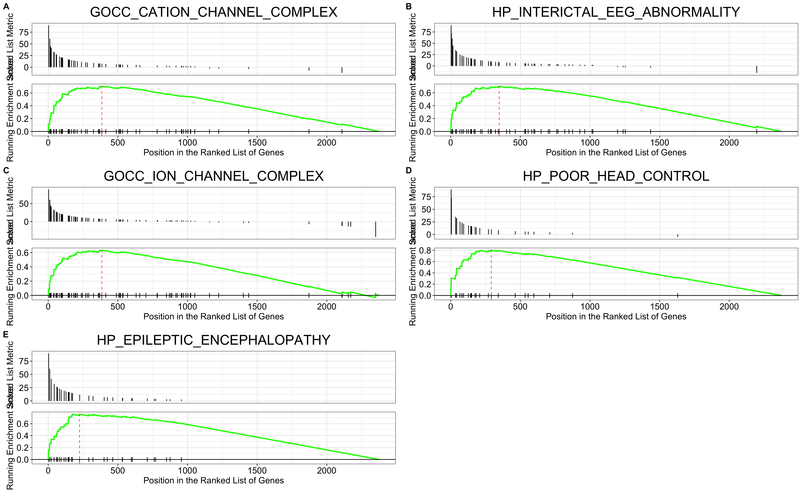
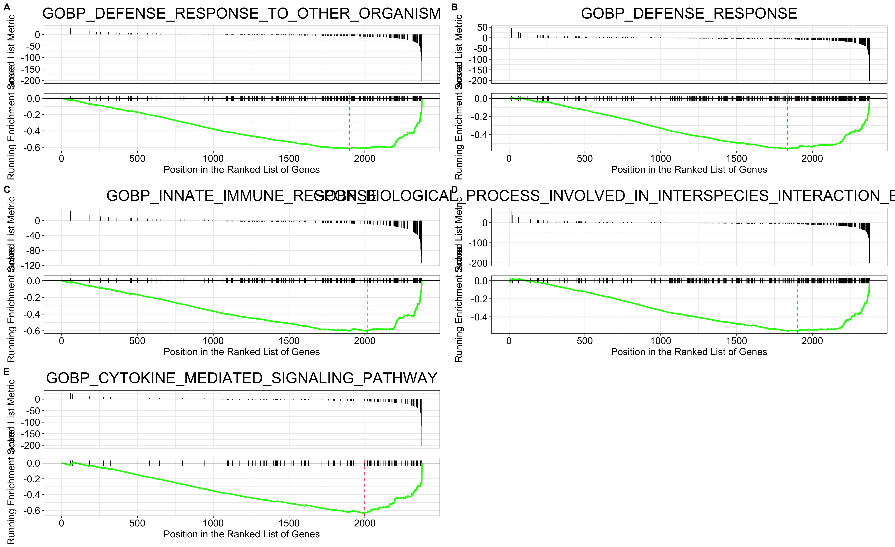

```{r setup, warning=FALSE, message=FALSE}
knitr::opts_chunk$set(echo = TRUE)
# install.packages('DT')
# BiocManager::install("EnhancedVolcano")
# BiocManager::install( "DESeq2" )
# install.packages("msigdbr")
# BiocManager::install("clusterProfiler")
# install.packages("ggpubr")
# install.packages("pheatmap")

library(DESeq2)
library(ggplot2)
library(dplyr)
library(tibble)
library(DT)
library(EnhancedVolcano)
library(recount)
library(glue)
library(org.Hs.eg.db)
library(AnnotationDbi)
library(dplyr)
library(msigdbr)
library(clusterProfiler)
library(ggpubr)
library(pheatmap)
```

# Abstract

Autism spectrum disorder (ASD) is a neurodevelopmental condition characterized by marked genetic heterogeneity. This study aimed at determining the effect of ASD on gene expression. It was found that ASD is linked with over-expression of epilepsy-related genes and under-expression of immune system-related genes. 

# Introduction

## Autism
Autism spectrum disorder (ASD) is a common, highly heritable neurodevelopmental condition characterized by marked genetic heterogeneity (Voineagu et al. 2011). Currently, the heterogeneity of autism is universally accepted at the phenotypic, imaged brain, and etiology levels (Mottron and Bzdok 2020). The purpose of this report was to analyze the RNA-Seq data obtained by Voineagu et al. and determine the effect of ASD on gene expression.

## Analyzed data 

Data consisted of 12 samples. 6 were obtained from autistic people (samples names: “Autism”) and the remaining from people without this condition (samples names: “Control”). Samples were taken from various parts of the brain. All the characteristics can be found in the undermentioned charts. 

Raw read count data was obtained from recount2, an online resource consisting of RNA-seq gene and exon counts for different studies (Ellis n.d.). The accession number was SRP007483. 

# Analysis and results 

Data were downloaded and loaded. 

```{r laoding_data, warning=FALSE, message=FALSE}
# Download the RangedSummarizedExperiment object at the gene level for 
url <- download_study('SRP007483')

# Load the data
load(file.path('SRP007483', 'rse_gene.Rdata'))

```

All data components are displayed below.

```{r display_data}
datatable(as.data.frame(colData(rse_gene)))
```

## Differential gene expression

To find differentially expressed genes (DEGs), differential gene expression analysis was performed with DESeq2. Results are displayed in the following table.  

```{r DESeq2, warning=FALSE, message=FALSE}
# Set up differentially expressed gene selection criteria
pThr <- 0.01 # for adj. p-value threshold (<= 0.01)
logFCThr <- 1 # for log2 fold-change (at least 2 fold)
baseMeanThr <- 20 # for average expression level (at least 20 counts).
cpmThr <- 1 # for copy-per-million (at least 1 cpm).

# Extract the sample characteristics
geochar <- lapply(split(colData(rse_gene), seq_len(nrow(colData(rse_gene)))), geo_characteristics)

geochar <- do.call(rbind, lapply(geochar, function(x) {
  for (name in colnames(x)) {
    return(x)
  }
}))

# Define some sample information to use
sample_info <- data.frame(
  run = colData(rse_gene)$run,
  tissue = geochar$tissue,
  sample.status = geochar$sample.status
)

# Scale counts by taking into account the total coverage per sample
rse <- scale_counts(rse_gene)

# Add sample information for DE analysis
colData(rse)$tissue <- sample_info$tissue
colData(rse)$sample.status <- sample_info$sample.status

# Perform differential expression analysis with DESeq2
# Specify design and switch to DESeq2 format
dds <- DESeqDataSet(rse, ~ tissue + sample.status)

## Perform DE analysis
dds <- DESeq(dds, test = "LRT", reduced = ~tissue, fitType = "local")
res <- results(dds)

# Select significant genes
idx <- which(res$padj <= pThr &
  abs(res$log2FoldChange) >= logFCThr &
  res$baseMean >= baseMeanThr)
sigRes <- res[idx, ]

datatable(as.data.frame(sigRes))
```
&nbsp;

Results were additionally displayed on a MA plot and saved to a file.

```{r DE_plot, fig.align="center"}
plotMA(res, ylim = c(-5, 5), main = "DESeq2 results for SRP007483")

write.table(sigRes,
  file = "SRP007483_sigGenes_adjp0.05_lfc1_bm20.txt",
  sep = "\t", col.names = TRUE, row.names = TRUE
)
```

Genes of interest (genes that showed significant levels of expression) were found in human genes database and all the obtained data was saved in a new table along with other previously obtained data. 

```{r create_outTable, warning=FALSE, message=FALSE}
# Change gene names to fit ENSEMBL format
gencode <- gsub("\\..*", "", row.names(sigRes))

# Find all the genes in human genes database 
anno <- AnnotationDbi::select(org.Hs.eg.db, gencode,
  columns = c("ENSEMBL", "ENTREZID", "SYMBOL", "GENENAME"),
  keytype = "ENSEMBL"
)

# Check which rows are duplicated and delete them

n_occur <- data.frame(table(anno$ENSEMBL))

n_occur <- n_occur[n_occur$Freq > 1, ]

anno <- anno[!duplicated(anno$ENSEMBL), ]

# Add ENSEMBL gene ID as a column in significant differentially expressed gene table.
sigRes <- cbind(OriginalENSEMBL = rownames(sigRes), sigRes)

sigRes <- cbind(ENSEMBL = gencode, sigRes)

# Join the tables
outTable <- left_join(as.data.frame(sigRes), anno)

# Display new table
datatable(outTable)


```
&nbsp;

Same steps were repeated for all the genes identified in the samples. 

```{r create_wholeTable, warning=FALSE, message=FALSE}

# Change gene names to fit ENSEMBL format
all_genes <- gsub("\\..*", "", row.names(res))

# Find all the genes in human genes database 
all_anno <- AnnotationDbi::select(org.Hs.eg.db, all_genes,
  columns = c("ENSEMBL", "ENTREZID", "SYMBOL", "GENENAME"),
  keytype = "ENSEMBL"
)

# Delete duplicated genes
all_anno <- all_anno[!duplicated(all_anno$ENSEMBL), ]


# Add ENSEMBL gene ID as a column in significant differentially expressed gene table.
res <- cbind(OriginalENSEMBL = rownames(res), res)

res <- cbind(ENSEMBL = all_genes, res)

res <- res[!duplicated(res$ENSEMBL), ]

# Join the tables
wholeTable <- left_join(as.data.frame(res), all_anno)

# Display new table
datatable(wholeTable)
```
&nbsp;

Both tables were saved in separate files.

```{r save_tables}
#Save tables
write.table(outTable,
  file = "SRP007483_sigGenes_adjp0.05_lfc1_bm20.txt",
  sep = "\t", col.names = TRUE, row.names = FALSE, quote = FALSE
)
write.table(wholeTable,
  file = "SRP007483_allGenes.txt",
  sep = "\t", col.names = TRUE, row.names = FALSE, quote = FALSE
)
```

### PCA plot

In order to visualize data correlations the following Principal Component Analysis (PCA) plot was created.

Principal Component Analysis is a dimensionality-reduction method often used in order to reduce the dimensionality of large data sets, by transforming them into smaller ones that still contain most of the information that the large set contains (Jaadi 2021). 

```{r pca, fig.align="center"}
# Perform regularized-logarithm transformation (rlog) on the data
rld <- rlog(dds)

# Plot Principal Component Analysis
plotPCA(rld, intgroup = c("sample.status"))
```

### Volcano plot

To show statistical significance (P value) versus magnitude of change (fold change) the following volcano plot was created.

```{r volcano, fig.align="center"}

EnhancedVolcano(outTable, lab = outTable$SYMBOL, x = "log2FoldChange", y="padj", border = "full", borderWidth = 1, borderColour = "black", gridlines.major = FALSE, gridlines.minor = FALSE, title = "Autistic versus Normal")

```

### Heatmap

For the top 10 over-expressed DEGs, and top 10 under-expressed DEGs the following heatmap was created. 

Disclaimer: The number of displayed genes is smaller than 20 because some of the identified genes did not have a name assigned to them and were removed. 

```{r heatmap, fig.align="center"}

mat <- assay(rld)
rownames(mat) <- gsub("\\..*", "", row.names(mat))

# Order  DEGs according to adjusted p-value
orderedSig <- outTable[order(outTable$padj), ]

# Extract ENSEMBL and SYMBOL data and save it in separate variables
id1 <- orderedSig$ENSEMBL
id2 <- orderedSig$SYMBOL

# Subset the count matrix using the ENSEMBL IDs
topDE <- mat[id1,]

# Replace row names with gene names
rownames(topDE) <- id2

# Join the top 10 over-expressed DEGs, and top 10 under-expressed DEGs in one matrix
top_bottom_DE <- rbind(head(topDE, n=10), tail(topDE, n=10))

# Remove rows with NA as gene name
top_bottom_DE <- na.omit(top_bottom_DE[row.names(top_bottom_DE) != "^NA",])

DEgenesTop <- mat[topDE,]

annotation <- as.data.frame(colData(rld)[, c("tissue","sample.status")])
pheatmap(top_bottom_DE, scale = "row", clustering_distance_rows = "correlation", annotation_col = annotation, main="Top 10 over-expressed \nand top 10 under-expressed \nDifferentially Expressed genes")
```

## Gene Set Enrichment Analysis

Additionally, Gene Set Enrichment Analysis (GSEA) was performed. 

GSEA is a computational method that determines whether a set of genes shows statistically significant over-representation in one of two biological states e.g. phenotypes (GSEA ).

```{r gsea_analysis, warning=FALSE, message=FALSE}

# Add a score for GSEA
outTable2 <- outTable %>%
  arrange(padj) %>%
  mutate(gsea_metric = -log10(padj) * sign(log2FoldChange))

# Deal with inf
outTable2 <- outTable2 %>%
  mutate(padj = case_when(padj == 0 ~ .Machine$double.xmin,
                          TRUE ~ padj)) %>%
  mutate(gsea_metric = -log10(padj) * sign(log2FoldChange))

# Remove NAs and order by GSEA
outTable2 <- outTable2 %>%
  filter(! is.na(gsea_metric)) %>%
  arrange(desc(gsea_metric))
View(outTable2)

# Get the ranked GSEA vector
ranks <- outTable2 %>%
  select(SYMBOL, gsea_metric) %>%
  distinct(SYMBOL, .keep_all = TRUE) %>%
  deframe()

# Get the gene sets and wrangle
gene_sets <- msigdbr(species = "Homo sapiens", category = "C5")
gene_sets <- gene_sets %>%
  dplyr::select(gs_name, gene_symbol)

# Run GSEA
gseares <- GSEA(geneList = ranks, 
                TERM2GENE = gene_sets)
gsearesdf <- as.data.frame(gseares)
View(gsearesdf)
```

GSEA plots were created for the top 5 over-expressed pathways and can be found below. 

```{r gsea_top_plots, warning=FALSE, message=FALSE, fig.align = "center"}

# Make GSEA plot for top and bottom results
# Get top 5 over-expressed pathways
top_pathways <- gsearesdf %>%
  top_n(n = 5, wt = NES) %>%
  pull(ID)

# Make gseaplot for each and return as list
top_pathway_plots <- lapply(top_pathways, function(pathway) {
  gseaplot(gseares, geneSetID = pathway, title = pathway)
})

# Arrange with labels as a multi-panel plot
top_pathway_plot <- ggarrange(plotlist = top_pathway_plots,
                              ncol = 2, nrow = 3, labels = "AUTO")

# Save it
ggsave(top_pathway_plot, filename = "top_GSEA_up.png",
       height = 11, width = 18)


```
&nbsp;

GSEA plots were also created for the top 5 under-expressed pathways and can be found below. 

```{r gsea_bottom_plots, warning=FALSE, message=FALSE, fig.align = "center"}

# Repeat steps with top 5 under-expressed pathways
bottom_pathways <- gsearesdf %>%
  top_n(n = 5, wt = -NES) %>%
  pull(ID)
bottom_pathway_plots <- lapply(bottom_pathways, function(pathway) {
  gseaplot(gseares, geneSetID = pathway, title = pathway)
})

bottom_pathway_plot <- ggarrange(plotlist = bottom_pathway_plots,
                                 ncol = 2, nrow = 3, labels = "AUTO")
ggsave(bottom_pathway_plot, filename = "bottom_GSEA_down.png",
       height = 11, width = 18)


```

# Conclusions 

The majority (57%) of the variance in the data occurs on this first principal component. 57% is not a very high result. It is probably due to outliers visible in the upper right corner of the plot. PCA plot shows that there are significant differences between the two studied groups. 

The volcano plot shows that there are more under-expressed than over-expressed genes in the autism samples in comparison to control samples. 

Heatmap shows which genes are connected in some way but to know exactly what relationships they have or what pathways they are part of it is needed to look at the GSEA results. 

The most over-expressed gene sets and according descriptions from the GSEA website (GSEA ) are displayed in the following table.  

```{r top_descriptions_table}
top_descriptions <- as.data.frame(top_pathways)
colnames(top_descriptions) <- c("Gene_set_name")
top_descriptions$Description <- c("An ion channel complex through which cations pass.",
                                  "Enables the transfer of a proton from one side of a membrane to the other.",
                                  "Interictal electroencephalographic (EEG) abnormality. Interictal refers to a period of time between epileptic seizures. EEG patterns are important in the differential diagnosis of epilepsy.",
                                  "Difficulty to maintain correct position of the head while standing or sitting.",
                                  "Epileptic encephalopathy, a condition in which epileptiform abnormalities are believed to contribute to the progressive disturbance in cerebral function. Epileptic encephalaopathy is characterized by (1) electrographic EEG paroxysmal activity that is often aggressive, (2) seizures that are usually multiform and intractable, (3) cognitive, behavioral and neurological deficits that may be relentless, and (4) sometimes early death. ")

datatable(top_descriptions)
```
 
A similar table was made for the under-expressed genes.
 
```{r bottom_descriptions_table}
bottom_descriptions <- as.data.frame(bottom_pathways)
bottom_descriptions[5,] <- c("GOBP_ADAPTIVE_IMMUNE_RESPONSE_BASED_ON_\nSOMATIC_RECOMBINATION_OF_IMMUNE_RECEPTORS_\nBUILT_FROM_IMMUNOGLOBULIN_SUPERFAMILY_DOMAINS")
bottom_descriptions[4,] <- c("GOBP_BIOLOGICAL_PROCESS_INVOLVED_IN_\nINTERSPECIES_INTERACTION_BETWEEN_ORGANISMS")

colnames(bottom_descriptions) <- c("Gene_set_name")
bottom_descriptions$Description <- c("-", 
                                     "Reactions, triggered in response to the presence of a foreign body or the occurrence of an injury, which result in restriction of damage to the organism attacked or prevention/recovery from the infection caused by the attack.",
                                     "Innate immune responses are defense responses mediated by germline encoded components that directly recognize components of potential pathogens.",
                                     "Any process evolved to enable an interaction with an organism of a different species. ",
                                     "An immune response mediated by lymphocytes expressing specific receptors for antigen produced through a somatic diversification process that includes somatic recombination of germline gene segments encoding immunoglobulin superfamily domains. Recombined receptors for antigen encoded by immunoglobulin superfamily domains include T cell receptors and immunoglobulins (antibodies) produced by B cells.")

datatable(bottom_descriptions)
```

Results show a link between epilepsy-related genes and autism, which makes sense as epilepsy is more common in autistic people than in the general population (Lukmanji et al. 2019). On the other hand, the under-expressed genes are related to the immune system. 

# Discussion 

To make the results of this study more reliable it is advised to repeat it with an increased number of samples. It was established that there is a link between epilepsy and autism, but the details of this relationship remain unknown. It is proposed to perform a similar analysis with data retrieved from patients who have only autism, only epilepsy, and both to understand the differences between these two disorders. 

A link between the immune system and autism was also detected. It is not clear whether autism is caused by immunological factors or autoimmune factors cause autism as has been recently proposed (Heidari et al. 2021). This can be tested by treating autistic patients with anti-inflammatory drugs and observing whether there is any improvement.  

# Bibliography 
